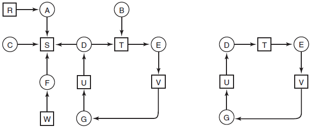

# Python Graph Cycle Detection

A simple Python program to detect cycles in a directed graph. Below is a sample image of the graph used for testing [source: Modern Operating Systems, 4th ed]. The left image shows the original nodes in the graph. The right image shows the reduced graph with all identified cycles.

### Using the Class

To use `CycleFinder` in your code, simply place `cycle_finder.py` in your project directory and include the following import at the top of your script:

`from cycle_finder import CycleFinder`

### Testing

Note: If a node does not have any edges originating from it, be sure to still specify its value as an empty list, `[]`, in the dictionary. Consider node 'S' in
the image above as an example.